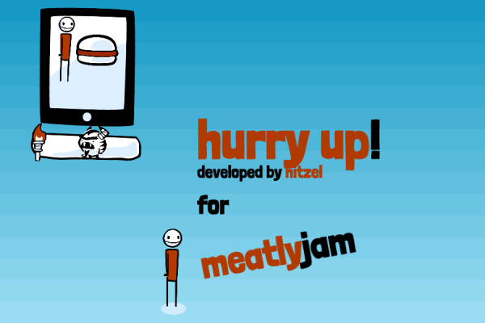

# [GOTO: game](index.html)

# meatly
- submission to the 1st meatlyjam ever [www.meatlyjam.com](http://www.meatlyjam.com "tada")
- my first gamejam!
- I have never done anything with `phaser.js` before. So all the knowledge had to be earned within these 48 hours

# timeline (GMT+1)
- 16:00 uff, exam is over! Lets get home.
- 17:00 meatlyjam starts! My first gamejam!!! Wuhu :banana:
- 18:02 using [nitzel.github.io](http://nitzel.github.io "this is a link you can click") to present this. quite a cool thing, this github.io
- 18:36 oh my, time flies. where did these 96minutes go? But I got a simple Idea. *Just make something*, right? This will be **awesome**.
- 19:13 downloaded phaser.js - how does it work?
- 20:23 finished phaser.js tutorial. **not too confident**
- 00:06 ate, played around with phaser examples and founda googlefont which is okay. not good, but okay. its free :) there is another one that looks better, but its not free :(
- 07:48 up again and ready to rumble.
- 11:56 shadow and sound added
- 12:00 17hours are gone. forever! :( And I still need to dig more into this **phaser** framework thing.
- 12:32 equal speed in all directions when walking
- 13:30 new ideas regarding intro :)
- 13:45 camera targets player, fixed texts
- 14:56 colored text :) that linebreak-thing took me a while...
- 15:04 that linebreak-thing is still not working completely! GNAH!
- 15:10 got'cha! finally
- 17:00 Half the time's over! 24h left **gogogo**
- 17:29 Uff finally shadowed objects get created correctly! that was not too easy. Why does PHASER have to scale the width/height of a bounding box, but NOT the offset??? **todo** report as maybe-bug
- 17:40 Fixed background
- 19:26 Added some sounds, fairy and nintendo
- 21:04 cooked some nice meal. no idea how i get a simple z-order for my sprites yet :(
- 22:29 looked for some music, didnt find any. Added some sounds and the downfish. Entities are now grouped, maybe I can do sth about the visibility/zorder
- 23:47 not productive ... failed at loading screen xD
- 00:01 gotta get some sleep. tomorrow there are still around 10hrs to do it!
- 08:30 good morning, we had a time-zone-change (in the old time-zone it's 7:30, I did NOT sleep longer)so I can work 11h30m till **6pm**. GO!
- 09:02 workstation added
- 09:02 workstations increment project progress and drain ideas/food/motivation (depending on how much you have)
- 11:17 fiddled around too long with the HUD, looks like time is running out. 7 hours left. **Shuuuu**
- 11:46 progress bar!! in HuD
- 12:00 boss is watching you aka time is running out
- 12:48 now we deal with pause-time :) its not subtracted from the time you have
- 13:11 hunger and motivation grow now by time, and its checked that they stay in range.
- 13:53 entities start moving as soon as they enter "world" which is close to view. they get destroyed when they leave it again.
- 14:21 adapted sound-volumes. and player got also destroyed, fixed that
- 14:57 WUHU **Z-ORDER** WORKS!!! :banana: !!! YEAH!
- 15:50 The first parts of the introduction level are done :)
- ... (not sure what happened here)
- before 18:00 I submitted the game
- after 18:00 mail from themeatly: github.io is not working (my host). *fuuuu*
- even later ... now it does :)
- **DAMN IT!** its not working as it should. That means, there is only a tutorial playable. Everything after it may be stuttering. If you know how to fix that, please dont hesitate to contact me!
# later ...
- looks like github was under a huuuuge DoS attack... for DAYS!
- now spawning works with a pool of sprites and different collision detection :confused: however, it works.

# [credits](credits.md)